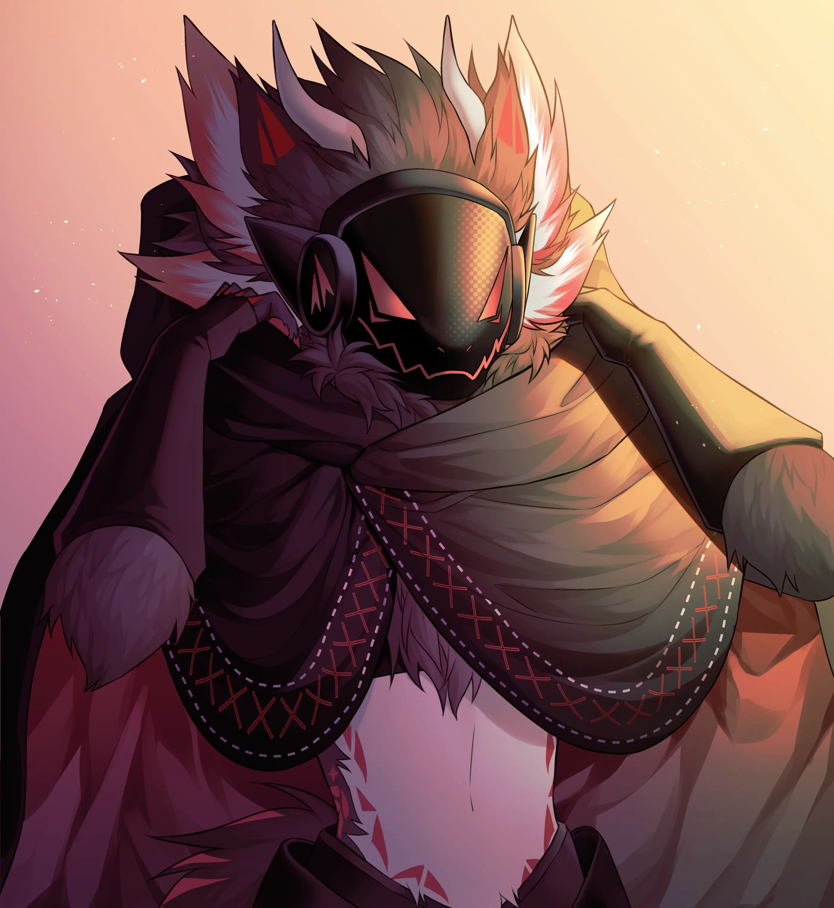

# KMMX-Web

A character showcase website featuring Kimmix, an Uncommon Protogen researcher specializing in Arcai energy manipulation and materialization.

## Project Overview

KMMX-Web is a creative portfolio website that showcases the fictional character Kimmix, a researcher within the Nehixim Research Division. The site features:

- Interactive character biography and lore
- Visual gallery of artwork
- Interactive starmap
- Character abilities and equipment showcase
- Responsive design with modern animations

## Character Background

Kimmix is an Uncommon Protogen researcher who specializes in Arcai Materialization—the ability to manipulate Arcai energy to harness dark energy and form physical objects. The character has a complex relationship with the Nehixim organization, balancing official research assignments with personal ethical convictions about knowledge sharing.

Key character elements include:

- Special abilities like Resonant Shard, Arcai Field, Neural Surge, and Dimensional Shift
- Advanced equipment including AENCC, Arcai Resonator, and Neural Dampeners
- Rich backstory spanning from 2020-2025 with significant research milestones

## Website Structure

The website consists of several interconnected pages:

- `index.html` - Main landing page
- `main.html` - Primary character information
- `kimmix.html` - Detailed character bio and stats
- `gallery.html` - Showcase of visual artwork
- `starmap.html` - Interactive stellar navigation interface
- `section.html` - Additional content sections

### Asset Organization

- `/assets/css/` - Stylesheet files for each page
- `/assets/img/` - Character images and reference materials
- `/assets/svg/` - Vector graphics including character abilities, logo, and UI elements
- `/assets/gallery/` - Gallery images and configuration
- `/assets/hero/` - Hero section assets
- `/assets/video/` - Video content with various format options
- `/js/` - JavaScript for interactivity and animations

## Technologies Used

- HTML5/CSS3 for structure and styling
- JavaScript for interactive elements
- GSAP (GreenSock Animation Platform) for advanced animations
- Lenis for smooth scrolling effects
- Custom SVG animations
- Responsive design for multiple device formats

## Development Setup

1. Clone this repository
2. No build process required - this is a static HTML website
3. Open any HTML file in a modern browser to view

## Browser Compatibility

The website is optimized for modern browsers including:

- Chrome (latest)
- Firefox (latest)
- Safari (latest)
- Edge (latest)

## License

All rights reserved. The character Kimmix and all associated artwork and lore are creative property.

---

Created by Kimmi - A creative artist and developer from Thailand
